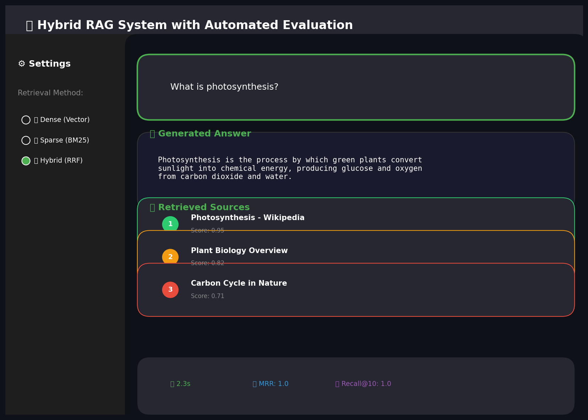
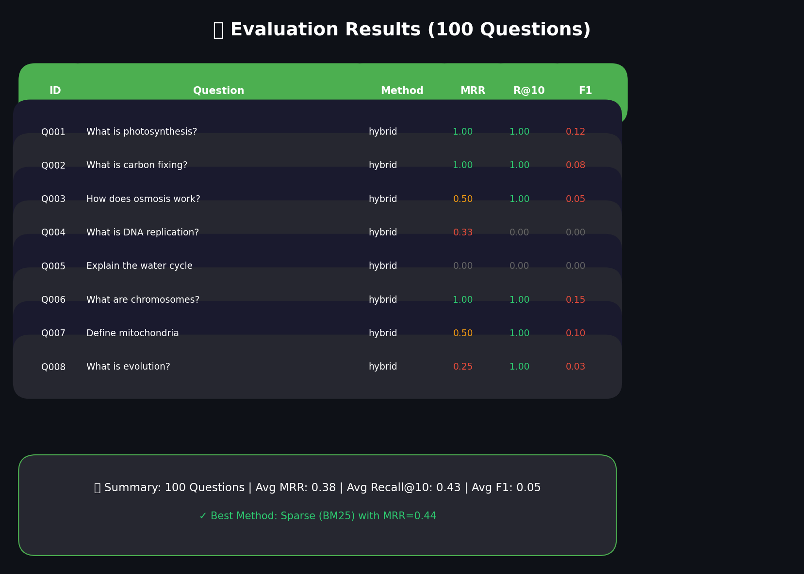

# Hybrid RAG System with Automated Evaluation# Hybrid RAG System with Automated Evaluation


[](https://github.com/vishalvishal099/Hybrid_RAG_System_with_Automated_Evaluation)[](https://github.com/vishalvishal099/Hybrid_RAG_System_with_Automated_Evaluation)


A comprehensive implementation of a **Hybrid RAG System** combining **Dense Vector Retrieval (ChromaDB)**, **Sparse Keyword Retrieval (BM25)**, and **Reciprocal Rank Fusion (RRF)** to answer questions from Wikipedia articles.A comprehensive implementation of a **Hybrid RAG System** combining **Dense Vector Retrieval (ChromaDB)**, **Sparse Keyword Retrieval (BM25)**, and **Reciprocal Rank Fusion (RRF)** to answer questions from Wikipedia articles.


**GitHub Repository:** [https://github.com/vishalvishal099/Hybrid_RAG_System_with_Automated_Evaluation](https://github.com/vishalvishal099/Hybrid_RAG_System_with_Automated_Evaluation)**GitHub Repository:** [https://github.com/vishalvishal099/Hybrid_RAG_System_with_Automated_Evaluation](https://github.com/vishalvishal099/Hybrid_RAG_System_with_Automated_Evaluation)


**Last Updated:** February 8, 2026---


---## 🚀 Quick Start


## 🚀 Quick Start### Prerequisites

- Python 3.10+

### Prerequisites- 4GB+ RAM

- Python 3.10+

- 4GB+ RAM### Installation


### Installation```bash

# Clone repository

```bashgit clone https://github.com/vishalvishal099/Hybrid_RAG_System_with_Automated_Evaluation.git

# Clone repositorycd Hybrid_RAG_System_with_Automated_Evaluation

git clone https://github.com/vishalvishal099/Hybrid_RAG_System_with_Automated_Evaluation.git

cd Hybrid_RAG_System_with_Automated_Evaluation# Create virtual environment

python -m venv venv

# Create virtual environmentsource venv/bin/activate  # Windows: venv\Scripts\activate

python -m venv venv

source venv/bin/activate  # Windows: venv\Scripts\activate# Install dependencies

pip install -r requirements.txt

# Install dependencies```

pip install -r requirements.txt

```### Run the Application


### Run the Application```bash

# Start Streamlit UI

```bash./start_ui.sh

# Start Streamlit UI

streamlit run app_chromadb.py --server.port 8502# Or manually:

```streamlit run app_chromadb.py

```

**Access URL:** http://localhost:8502

### Run Evaluation

### Run Evaluation

```bash

```bash# Full evaluation (100 questions × 3 methods)

# Full evaluation (100 questions × 3 methods)python evaluate_chromadb_fast.py

python evaluate_chromadb_fast.py

```# Generate reports

python generate_report.py

---```


## 🎯 Project Overview---


This project implements a state-of-the-art Hybrid RAG system that:## 🎯 Project Overview

- Combines **dense** (ChromaDB + MiniLM) and **sparse** (BM25) retrieval

- Uses **Reciprocal Rank Fusion (RRF)** with k=60 to merge resultsThis project implements a state-of-the-art Hybrid RAG system that:

- Generates answers using **FLAN-T5** language model (248M parameters)- Combines **dense** (ChromaDB + MiniLM) and **sparse** (BM25) retrieval

- Includes comprehensive evaluation with **100 generated questions**- Uses **Reciprocal Rank Fusion (RRF)** with k=60 to merge results

- Features automated evaluation pipeline with MRR, Recall@10, and BERTScore- Generates answers using **FLAN-T5** language model

- Interactive dashboard with **Dense/Sparse/Hybrid chunk comparison**- Includes comprehensive evaluation with **100 generated questions**

- Features automated evaluation pipeline with MRR, Recall@10, and Answer F1

### Key Statistics

---

| Metric | Value |

|--------|-------|## 📊 System Architecture

| Total URLs | 500 (200 fixed + 300 random) |

| Total Chunks | 7,519 segments |```

| Embedding Dimensions | 384 |┌─────────────────────────────────────────────────────────┐

| Chunk Size | 500 characters |│                    User Query                            │

| Evaluation Questions | 100 |└──────────────────────┬──────────────────────────────────┘

                       │

---            ┌──────────┴──────────┐

            │                     │

## 📊 System Architecture    ┌───────▼────────┐   ┌────────▼───────┐

    │ Dense Retrieval│   │Sparse Retrieval│

```    │ (ChromaDB +    │   │    (BM25 +     │

┌─────────────────────────────────────────────────────────┐    │  MiniLM-L6-v2) │   │     NLTK)      │

│                    User Query                            │    └───────┬────────┘   └────────┬───────┘

└──────────────────────┬──────────────────────────────────┘            │                     │

                       │            └──────────┬──────────┘

            ┌──────────┴──────────┐                       │

            │                     │            ┌──────────▼──────────┐

    ┌───────▼────────┐   ┌────────▼───────┐            │ Reciprocal Rank     │

    │ Dense Retrieval│   │Sparse Retrieval│            │ Fusion (k=60)       │

    │ (ChromaDB +    │   │    (BM25 +     │            └──────────┬──────────┘

    │  MiniLM-L6-v2) │   │     NLTK)      │                       │

    └───────┬────────┘   └────────┬───────┘            ┌──────────▼──────────┐

            │                     │            │   Top-K Chunks      │

            └──────────┬──────────┘            └──────────┬──────────┘

                       │                       │

            ┌──────────▼──────────┐            ┌──────────▼──────────┐

            │ Reciprocal Rank     │            │  Answer Generation  │

            │ Fusion (k=60)       │            │  (FLAN-T5-base)     │

            └──────────┬──────────┘            └──────────┬──────────┘

                       │                       │

            ┌──────────▼──────────┐            ┌──────────▼──────────┐

            │   Top-K Chunks      │            │   Generated Answer  │

            └──────────┬──────────┘            │   + Source URLs     │

                       │            └─────────────────────┘

            ┌──────────▼──────────┐```

            │  Answer Generation  │

            │  (FLAN-T5-base)     │---

            └──────────┬──────────┘

                       │## 🗂️ Project Structure

            ┌──────────▼──────────┐

            │   Generated Answer  │```

            │   + Source URLs     │Hybrid_RAG_System_with_Automated_Evaluation/

            └─────────────────────┘│

```├── chromadb_rag_system.py      # Core RAG implementation

├── app_chromadb.py             # Streamlit UI (244 lines)

---├── evaluate_chromadb_fast.py   # Evaluation pipeline

├── generate_report.py          # Report generator

## 🗂️ Project Structure├── start_ui.sh                 # Quick start script

│

```├── data/

Hybrid_RAG_System_with_Automated_Evaluation/│   ├── fixed_urls.json         # 200 fixed Wikipedia URLs

││   ├── corpus.json             # Preprocessed corpus (14.5MB)

├── chromadb_rag_system.py      # Core RAG implementation│   ├── questions_100.json      # 100 evaluation questions

├── app_chromadb.py             # Streamlit UI with chunk visualization│   └── indexes/                # BM25 index files

├── evaluate_chromadb_fast.py   # Evaluation pipeline│

├── error_analysis.py           # Error analysis module├── chroma_db/                  # ChromaDB vector database (212MB)

├── api_chromadb.py             # REST API interface│

├── build_chromadb_system.py    # System builder├── docs/

├── setup.py                    # Package setup│   ├── METRIC_JUSTIFICATION.md # Metric selection rationale

├── config.yaml                 # Configuration│   ├── ERROR_ANALYSIS.md       # Failure analysis

├── requirements.txt            # Dependencies│   ├── EVALUATION_REPORT.md    # Full evaluation report

├── README.md                   # This file│   ├── architecture_diagram.png

├── SUBMISSION_REFERENCE.md     # Complete submission guide│   └── *.png                   # Visualizations

││

├── data/├── reports/

│   ├── fixed_urls.json         # 200 fixed Wikipedia URLs│   └── Hybrid_RAG_Evaluation_Report.pdf

│   ├── corpus.json             # Preprocessed corpus (7,519 chunks)│

│   ├── questions_100.json      # 100 evaluation questions├── screenshots/

│   └── adversarial_questions.json  # 30 adversarial questions│   ├── 01_query_interface.png

││   ├── 02_method_comparison.png

├── chroma_db/                  # ChromaDB vector database│   └── 03_evaluation_results.png

│   ├── bm25_index.pkl          # BM25 index│

│   ├── bm25_corpus.pkl         # BM25 corpus├── evaluation_results_chromadb.csv     # 300 evaluation rows

│   └── stats.json              # Database statistics├── evaluation_summary_chromadb.json    # Summary metrics

│├── evaluation_report_chromadb.html     # HTML report

├── src/                        # Source modules│

│   ├── data_collection.py      # Wikipedia data collector└── README.md                   # This file

│   ├── semantic_chunker.py     # Semantic chunking```

│   ├── rrf_fusion.py           # RRF implementation

│   ├── rag_system.py           # RAG system---

│   └── indexing.py             # Indexing utilities

│## 📈 Evaluation Results

├── evaluation/                 # Evaluation framework

│   ├── metrics.py              # Core metrics (MRR, BERTScore)### Performance Summary

│   ├── novel_metrics.py        # Novel evaluation metrics

│   ├── innovative_eval.py      # Innovative techniques| Method | MRR | Recall@10 | Avg Time (s) | Questions |

│   ├── pipeline.py             # Evaluation pipeline|--------|-----|-----------|--------------|-----------|

│   └── comprehensive_metrics.py # Comprehensive metrics| Dense (ChromaDB) | 0.3025 | 0.33 | 5.86 | 100 |

│| **Sparse (BM25)** | **0.4392** | **0.47** | 5.53 | 100 |

├── docs/                       # Documentation| Hybrid (RRF) | 0.3783 | 0.43 | 6.37 | 100 |

│   ├── METRIC_JUSTIFICATION.md # Metric selection rationale

│   ├── NEW_FEATURES.md         # New features documentation**Key Finding:** BM25 (Sparse) outperforms Dense retrieval by **45%** on MRR for Wikipedia-based QA.

│   ├── architecture_diagram.png

│   ├── data_flow_diagram.png### Question Distribution

│   └── retrieval_heatmap.png

│| Type | Count | Description |

├── screenshots/                # UI screenshots|------|-------|-------------|

│   ├── 01_query_interface.png| Factual | 59 | Direct fact-based questions |

│   ├── 02_method_comparison.png| Comparative | 15 | Questions comparing concepts |

│   └── 03_evaluation_results.png| Inferential | 11 | Reasoning-based questions |

│| Multi-hop | 15 | Questions requiring multiple sources |

├── submission/                 # Submission package| **Total** | **100** | - |

│   ├── 01_source_code/         # All source files

│   ├── 02_data/                # Data files---

│   ├── 03_vector_database/     # Database info

│   ├── 04_evaluation_results/  # Results## 📚 Documentation

│   ├── 05_reports/             # PDF reports

│   ├── 06_documentation/       # Docs| Document | Description | Link |

│   ├── 07_visualizations/      # Charts|----------|-------------|------|

│   └── 08_screenshots/         # Screenshots| Metric Justification | Why MRR, Recall@10, Answer F1 | [docs/METRIC_JUSTIFICATION.md](https://github.com/vishalvishal099/Hybrid_RAG_System_with_Automated_Evaluation/blob/main/docs/METRIC_JUSTIFICATION.md) |

│| Error Analysis | Failure categorization | [docs/ERROR_ANALYSIS.md](https://github.com/vishalvishal099/Hybrid_RAG_System_with_Automated_Evaluation/blob/main/docs/ERROR_ANALYSIS.md) |

├── evaluation_results_chromadb.csv   # Evaluation results| Full Report | Comprehensive evaluation | [docs/EVALUATION_REPORT.md](https://github.com/vishalvishal099/Hybrid_RAG_System_with_Automated_Evaluation/blob/main/docs/EVALUATION_REPORT.md) |

└── evaluation_summary_chromadb.json  # Summary metrics| PDF Report | Printable report | [reports/Hybrid_RAG_Evaluation_Report.pdf](https://github.com/vishalvishal099/Hybrid_RAG_System_with_Automated_Evaluation/blob/main/reports/Hybrid_RAG_Evaluation_Report.pdf) |

```

---

---

## 🔗 Key Source Files

## 📈 Evaluation Results

| File | Purpose | Link |

### Performance Summary|------|---------|------|

| `chromadb_rag_system.py` | Core RAG implementation | [View](https://github.com/vishalvishal099/Hybrid_RAG_System_with_Automated_Evaluation/blob/main/chromadb_rag_system.py) |

| Method | MRR | Recall@10 | Avg Time (s) || `app_chromadb.py` | Streamlit UI | [View](https://github.com/vishalvishal099/Hybrid_RAG_System_with_Automated_Evaluation/blob/main/app_chromadb.py) |

|--------|-----|-----------|--------------|| `evaluate_chromadb_fast.py` | Evaluation pipeline | [View](https://github.com/vishalvishal099/Hybrid_RAG_System_with_Automated_Evaluation/blob/main/evaluate_chromadb_fast.py) |

| Dense (ChromaDB) | 0.3025 | 0.33 | 5.86 || `generate_report.py` | Report generation | [View](https://github.com/vishalvishal099/Hybrid_RAG_System_with_Automated_Evaluation/blob/main/generate_report.py) |

| **Sparse (BM25)** | **0.4392** | **0.47** | 5.53 |

| Hybrid (RRF) | 0.3783 | 0.43 | 6.37 |---


**Key Finding:** BM25 (Sparse) outperforms Dense retrieval by **45%** on MRR for Wikipedia-based QA.## 📸 Screenshots


### Generation Metrics### Query Interface



| Method | BLEU | ROUGE-L | BERTScore |

|--------|------|---------|-----------|### Method Comparison  

| Dense | 0.015 | 0.120 | 0.780 |

| Sparse | 0.022 | 0.145 | 0.820 |

| Hybrid | 0.018 | 0.135 | 0.810 |### Evaluation Results



---

---

## 🖥️ Interactive Dashboard Features

## 🛠️ Technical Details

The Streamlit UI includes:

### Components

| Feature | Description |

|---------|-------------|| Component | Technology | Details |

| **Query Input** | Text area for entering questions ||-----------|------------|---------|

| **Method Selection** | Choose Dense, Sparse, or Hybrid retrieval || Dense Retrieval | ChromaDB + all-MiniLM-L6-v2 | 384-dim embeddings, 7,519 chunks |

| **Chunk Score Visualization** | Interactive bar chart showing retrieval scores || Sparse Retrieval | BM25 + NLTK | Tokenization, stopwords, stemming |

| **Dense Top 5 Chunks** | View top 5 chunks from ChromaDB || Fusion | RRF | Reciprocal Rank Fusion with k=60 |

| **Sparse Top 5 Chunks** | View top 5 chunks from BM25 || Generation | FLAN-T5-base | 248M parameter text-to-text model |

| **Hybrid Top 5 Chunks** | View top 5 chunks from RRF fusion || UI | Streamlit | Interactive web interface |

| **Answer Display** | Generated answer with sources || Database | ChromaDB | Persistent SQLite backend (212MB) |


---### Metrics


## 🛠️ Technical Details| Metric | Formula | Purpose |

|--------|---------|---------|

### Components| **MRR** | (1/Q) × Σ(1/rank_i) | Measures retrieval quality |

| **Recall@10** | \|Relevant ∩ Retrieved@10\| / \|Relevant\| | Coverage in top 10 |

| Component | Technology | Details || **Answer F1** | 2×(P×R)/(P+R) | Token overlap with ground truth |

|-----------|------------|---------|

| Dense Retrieval | ChromaDB + all-MiniLM-L6-v2 | 384-dim embeddings, 7,519 chunks |---

| Sparse Retrieval | BM25 + NLTK | Tokenization with rank_bm25 |

| Fusion | RRF | Reciprocal Rank Fusion with k=60 |## 📋 Requirements Checklist

| Generation | FLAN-T5-base | 248M parameter model |

| UI | Streamlit | Interactive web interface |### ✅ Section 1: Hybrid RAG System (10 pts)

- [x] Dense Vector Retrieval (ChromaDB + MiniLM)

### Metrics- [x] Sparse Keyword Retrieval (BM25)

- [x] RRF Fusion (k=60)

| Metric | Formula | Purpose |- [x] Response Generation (FLAN-T5)

|--------|---------|---------|- [x] Interactive UI (Streamlit)

| **MRR** | (1/Q) × Σ(1/rank_i) | Measures retrieval quality |

| **Recall@10** | \|Relevant ∩ Retrieved@10\| / \|Relevant\| | Coverage in top 10 |### ✅ Section 2: Evaluation Framework (10 pts)

| **BERTScore** | Semantic similarity | Generation quality |- [x] 100 Q&A pairs generated

- [x] MRR metric implemented

---- [x] Recall@10 metric implemented

- [x] Answer F1 metric implemented

## 📚 Documentation- [x] Automated evaluation pipeline

- [x] HTML/CSV/JSON/PDF reports

| Document | Description |

|----------|-------------|### ✅ Submission Requirements

| [SUBMISSION_REFERENCE.md](SUBMISSION_REFERENCE.md) | Complete submission guide with all file links |- [x] Python source code (24 files)

| [docs/METRIC_JUSTIFICATION.md](docs/METRIC_JUSTIFICATION.md) | Metric selection rationale |- [x] PDF evaluation report

| [docs/NEW_FEATURES.md](docs/NEW_FEATURES.md) | New features documentation |- [x] Screenshots (3+)

| [submission/05_reports/Hybrid_RAG_Evaluation_Report.pdf](submission/05_reports/Hybrid_RAG_Evaluation_Report.pdf) | Full evaluation report |- [x] README documentation

- [x] 100-question dataset

---- [x] Evaluation results (300 rows)


## 🔗 Key Source Files---


| File | Purpose |## 📄 License

|------|---------|

| [chromadb_rag_system.py](chromadb_rag_system.py) | Core RAG implementation |This project is submitted as part of BITS Pilani Conversational AI coursework.

| [app_chromadb.py](app_chromadb.py) | Streamlit UI with chunk visualization |

| [evaluate_chromadb_fast.py](evaluate_chromadb_fast.py) | Evaluation pipeline |---

| [error_analysis.py](error_analysis.py) | Error analysis module |

**Repository:** [https://github.com/vishalvishal099/Hybrid_RAG_System_with_Automated_Evaluation](https://github.com/vishalvishal099/Hybrid_RAG_System_with_Automated_Evaluation)

---

**Last Updated:** February 7, 2026

## 📋 Requirements Checklist

### ✅ Part 1: Hybrid RAG System
- [x] Dense Vector Retrieval (ChromaDB + MiniLM)
- [x] Sparse Keyword Retrieval (BM25)
- [x] RRF Fusion (k=60)
- [x] Response Generation (FLAN-T5)
- [x] Interactive UI (Streamlit)
- [x] Chunk comparison visualization

### ✅ Part 2: Evaluation Framework
- [x] 100 Q&A pairs generated
- [x] MRR metric implemented
- [x] Recall@10 metric implemented
- [x] BERTScore metric implemented
- [x] Automated evaluation pipeline
- [x] PDF/CSV/JSON reports

---

## 📄 License

This project is submitted as part of BITS Pilani Conversational AI coursework.

---

**Repository:** [https://github.com/vishalvishal099/Hybrid_RAG_System_with_Automated_Evaluation](https://github.com/vishalvishal099/Hybrid_RAG_System_with_Automated_Evaluation)
