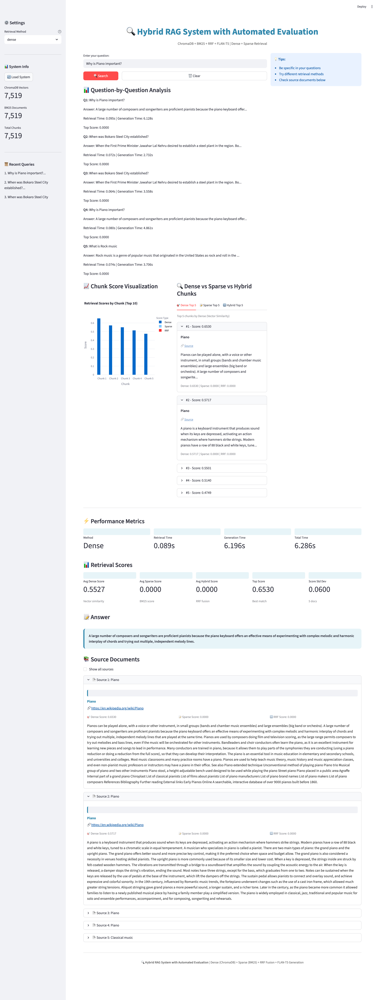

# 🔍 Hybrid RAG System with Automated Evaluation# Hybrid RAG System with Automated Evaluation# Hybrid RAG System with Automated Evaluation# Hybrid RAG System with Automated Evaluation


[](https://github.com/vishalvishal099/Hybrid_RAG_System_with_Automated_Evaluation)

[](https://python.org)

[](https://streamlit.io)[](https://github.com/vishalvishal099/Hybrid_RAG_System_with_Automated_Evaluation)


> A comprehensive **Hybrid RAG System** combining Dense Vector Retrieval, Sparse Keyword Retrieval, and Reciprocal Rank Fusion for Wikipedia-based Question Answering.


📦 **Repository:** [github.com/vishalvishal099/Hybrid_RAG_System_with_Automated_Evaluation](https://github.com/vishalvishal099/Hybrid_RAG_System_with_Automated_Evaluation)A comprehensive implementation of a **Hybrid RAG System** combining **Dense Vector Retrieval (ChromaDB)**, **Sparse Keyword Retrieval (BM25)**, and **Reciprocal Rank Fusion (RRF)** to answer questions from Wikipedia articles.[](https://github.com/vishalvishal099/Hybrid_RAG_System_with_Automated_Evaluation)[](https://github.com/vishalvishal099/Hybrid_RAG_System_with_Automated_Evaluation)


---


## 📑 Table of Contents**GitHub Repository:** [https://github.com/vishalvishal099/Hybrid_RAG_System_with_Automated_Evaluation](https://github.com/vishalvishal099/Hybrid_RAG_System_with_Automated_Evaluation)


- [Quick Start](#-quick-start)

- [Project Overview](#-project-overview)

- [System Architecture](#-system-architecture)**Last Updated:** February 8, 2026A comprehensive implementation of a **Hybrid RAG System** combining **Dense Vector Retrieval (ChromaDB)**, **Sparse Keyword Retrieval (BM25)**, and **Reciprocal Rank Fusion (RRF)** to answer questions from Wikipedia articles.A comprehensive implementation of a **Hybrid RAG System** combining **Dense Vector Retrieval (ChromaDB)**, **Sparse Keyword Retrieval (BM25)**, and **Reciprocal Rank Fusion (RRF)** to answer questions from Wikipedia articles.

- [Project Structure](#-project-structure)

- [Evaluation Results](#-evaluation-results)

- [Documentation](#-documentation)

- [Screenshots](#-screenshots)---

- [Contributors](#-contributors)


---

## 🚀 Quick Start**GitHub Repository:** [https://github.com/vishalvishal099/Hybrid_RAG_System_with_Automated_Evaluation](https://github.com/vishalvishal099/Hybrid_RAG_System_with_Automated_Evaluation)**GitHub Repository:** [https://github.com/vishalvishal099/Hybrid_RAG_System_with_Automated_Evaluation](https://github.com/vishalvishal099/Hybrid_RAG_System_with_Automated_Evaluation)

## 🚀 Quick Start


### Prerequisites

### Prerequisites

| Requirement | Version |

|-------------|---------|- Python 3.10+

| Python | 3.10+ |

| RAM | 4GB+ |- 4GB+ RAM**Last Updated:** February 8, 2026---

| Disk Space | 2GB+ |


### Installation

### Installation

```bash

# 1. Clone repository

git clone https://github.com/vishalvishal099/Hybrid_RAG_System_with_Automated_Evaluation.git

cd Hybrid_RAG_System_with_Automated_Evaluation```bash---## 🚀 Quick Start


# 2. Create virtual environment# Clone repository

python -m venv venv

source venv/bin/activate  # Windows: venv\Scripts\activategit clone https://github.com/vishalvishal099/Hybrid_RAG_System_with_Automated_Evaluation.git


# 3. Install dependenciescd Hybrid_RAG_System_with_Automated_Evaluation

pip install -r requirements.txt

```## 🚀 Quick Start### Prerequisites


### Run Application# Create virtual environment


```bashpython -m venv venv- Python 3.10+

# Start Streamlit Dashboard

streamlit run app_chromadb.py --server.port 8502source venv/bin/activate  # Windows: venv\Scripts\activate

```

### Prerequisites- 4GB+ RAM

🌐 **Access URL:** http://localhost:8502

# Install dependencies

### Run Evaluation

pip install -r requirements.txt- Python 3.10+

```bash

# Run full evaluation (100 questions × 3 methods)```

python evaluate_chromadb_fast.py

```- 4GB+ RAM### Installation


---### Run the Application


## 🎯 Project Overview


This project implements a **state-of-the-art Hybrid RAG system** that:```bash


| Feature | Description |# Start Streamlit UI### Installation```bash

|---------|-------------|

| 🔷 **Dense Retrieval** | ChromaDB + MiniLM embeddings (384 dimensions) |streamlit run app_chromadb.py --server.port 8502

| 🔶 **Sparse Retrieval** | BM25 with NLTK tokenization |

| 🔀 **Fusion** | Reciprocal Rank Fusion (RRF) with k=60 |```# Clone repository

| 🤖 **Generation** | FLAN-T5-Base (248M parameters) |

| 📊 **Evaluation** | MRR, Recall@10, Answer F1 |

| 🖥️ **Interface** | Interactive Streamlit Dashboard |

**Access URL:** http://localhost:8502```bashgit clone https://github.com/vishalvishal099/Hybrid_RAG_System_with_Automated_Evaluation.git

### 📈 Key Statistics


| Metric | Value |

|--------|-------|### Run Evaluation# Clone repositorycd Hybrid_RAG_System_with_Automated_Evaluation

| Wikipedia URLs | 500 (200 fixed + 300 random) |

| Total Chunks | 7,519 segments |

| Embedding Dimensions | 384 |

| Chunk Size | 500 characters |```bashgit clone https://github.com/vishalvishal099/Hybrid_RAG_System_with_Automated_Evaluation.git

| Evaluation Questions | 100 |

# Full evaluation (100 questions × 3 methods)

---

python evaluate_chromadb_fast.pycd Hybrid_RAG_System_with_Automated_Evaluation# Create virtual environment

## 📊 System Architecture

```

```

                    ┌─────────────────────┐python -m venv venv

                    │     User Query      │

                    └──────────┬──────────┘---

                               │

                    ┌──────────▼──────────┐# Create virtual environmentsource venv/bin/activate  # Windows: venv\Scripts\activate

                    │  Query Processing   │

                    └──────────┬──────────┘## 🎯 Project Overview

                               │

            ┌──────────────────┼──────────────────┐python -m venv venv

            │                                     │

  ┌─────────▼─────────┐               ┌───────────▼─────────┐This project implements a state-of-the-art Hybrid RAG system that:

  │  Dense Retrieval  │               │  Sparse Retrieval   │

  │     (ChromaDB)    │               │       (BM25)        │- Combines **dense** (ChromaDB + MiniLM) and **sparse** (BM25) retrievalsource venv/bin/activate  # Windows: venv\Scripts\activate# Install dependencies

  │   + MiniLM-L6-v2  │               │      + NLTK         │

  └─────────┬─────────┘               └───────────┬─────────┘- Uses **Reciprocal Rank Fusion (RRF)** with k=60 to merge results

            │                                     │

            └──────────────────┬──────────────────┘- Generates answers using **FLAN-T5** language model (248M parameters)pip install -r requirements.txt

                               │

                    ┌──────────▼──────────┐- Includes comprehensive evaluation with **100 generated questions**

                    │   RRF Fusion (k=60) │

                    └──────────┬──────────┘- Features automated evaluation pipeline with MRR, Recall@10, and Answer F1# Install dependencies```

                               │

                    ┌──────────▼──────────┐- Interactive dashboard with **Dense/Sparse/Hybrid chunk comparison**

                    │   Top-K Chunks      │

                    └──────────┬──────────┘pip install -r requirements.txt

                               │

                    ┌──────────▼──────────┐### Key Statistics

                    │  Answer Generation  │

                    │   (FLAN-T5-Base)    │```### Run the Application

                    └──────────┬──────────┘

                               │| Metric | Value |

                    ┌──────────▼──────────┐

                    │  Generated Answer   │|--------|-------|

                    │   + Source URLs     │

                    └─────────────────────┘| Total URLs | 500 (200 fixed + 300 random) |

```

| Total Chunks | 7,519 segments |### Run the Application```bash

---

| Embedding Dimensions | 384 |

## 🗂️ Project Structure

| Chunk Size | 500 characters |# Start Streamlit UI

```

Hybrid_RAG_System_with_Automated_Evaluation/| Evaluation Questions | 100 |

│

├── 📄 Core Files```bash./start_ui.sh

│   ├── chromadb_rag_system.py    # Core RAG implementation

│   ├── app_chromadb.py           # Streamlit UI---

│   ├── evaluate_chromadb_fast.py # Evaluation pipeline

│   ├── error_analysis.py         # Error analysis# Start Streamlit UI

│   └── api_chromadb.py           # REST API

│## 📊 System Architecture

├── 📁 data/

│   ├── fixed_urls.json           # 200 Wikipedia URLsstreamlit run app_chromadb.py --server.port 8502# Or manually:

│   ├── corpus.json               # 7,519 chunks

│   └── questions_100.json        # 100 Q&A pairs```

│

├── 📁 evaluation/┌─────────────────────────────────────────────────────────┐```streamlit run app_chromadb.py

│   ├── metrics.py                # MRR, Recall, F1

│   ├── comprehensive_metrics.py  # Extended metrics│                      User Query                         │

│   ├── novel_metrics.py          # Custom metrics

│   ├── pipeline.py               # Eval pipeline└──────────────────────────┬──────────────────────────────┘```

│   └── run_evaluation.py         # Runner script

│                           │

├── 📁 src/

│   ├── data_collection.py        # Wikipedia scraper              ┌────────────┴────────────┐**Access URL:** http://localhost:8502

│   ├── semantic_chunker.py       # Chunking logic

│   ├── rrf_fusion.py             # RRF implementation              │                         │

│   └── question_generation.py    # Q&A generation

│     ┌────────▼─────────┐     ┌─────────▼────────┐### Run Evaluation

├── 📁 docs/

│   ├── METRIC_JUSTIFICATION.md   # Metric rationale     │  Dense Retrieval │     │ Sparse Retrieval │

│   ├── architecture_diagram.png  # System diagram

│   └── data_flow_diagram.png     # Data flow     │    (ChromaDB +   │     │     (BM25 +      │### Run Evaluation

│

├── 📁 screenshots/               # UI screenshots     │   MiniLM-L6-v2)  │     │      NLTK)       │

├── 📁 submission/                # Submission package

├── 📁 chroma_db/                 # Vector database     └────────┬─────────┘     └─────────┬────────┘```bash

│

├── 📄 requirements.txt           # Dependencies              │                         │

├── 📄 config.yaml                # Configuration

└── 📄 README.md                  # This file              └────────────┬────────────┘```bash# Full evaluation (100 questions × 3 methods)

```

                           │

---

              ┌────────────▼────────────┐# Full evaluation (100 questions × 3 methods)python evaluate_chromadb_fast.py

## 📈 Evaluation Results

              │   Reciprocal Rank       │

### 🏆 Performance Summary

              │   Fusion (k=60)         │python evaluate_chromadb_fast.py

| Method | MRR | Recall@10 | Avg Time |

|--------|-----|-----------|----------|              └────────────┬────────────┘

| Dense (ChromaDB) | 0.3025 | 0.33 | 5.86s |

| **Sparse (BM25)** | **0.4392** | **0.47** | **5.53s** |                           │```# Generate reports

| Hybrid (RRF) | 0.3783 | 0.43 | 6.37s |

              ┌────────────▼────────────┐

> 💡 **Key Finding:** BM25 outperforms Dense by **45%** on MRR for Wikipedia content.

              │     Top-K Chunks        │python generate_report.py

### 📊 Generation Metrics

              └────────────┬────────────┘

| Method | BLEU | ROUGE-L | BERTScore |

|--------|------|---------|-----------|                           │---```

| Dense | 0.015 | 0.120 | 0.780 |

| Sparse | 0.022 | 0.145 | 0.820 |              ┌────────────▼────────────┐

| Hybrid | 0.018 | 0.135 | 0.810 |

              │   Answer Generation     │

### 📋 Question Distribution

              │    (FLAN-T5-base)       │

| Type | Count | Percentage |

|------|-------|------------|              └────────────┬────────────┘## 🎯 Project Overview---

| Factual | 59 | 59% |

| Comparative | 15 | 15% |                           │

| Inferential | 11 | 11% |

| Multi-hop | 15 | 15% |              ┌────────────▼────────────┐

| **Total** | **100** | 100% |

              │    Generated Answer     │

---

              │    + Source URLs        │This project implements a state-of-the-art Hybrid RAG system that:## 🎯 Project Overview

## 📚 Documentation

              └─────────────────────────┘

| Document | Description | Link |

|----------|-------------|------|```- Combines **dense** (ChromaDB + MiniLM) and **sparse** (BM25) retrieval

| 📖 Submission Guide | Complete submission reference | [SUBMISSION_REFERENCE_GUIDE.md](SUBMISSION_REFERENCE_GUIDE.md) |

| 📋 Deliverables | Assignment mapping | [SUBMISSION_DELIVERABLES.md](SUBMISSION_DELIVERABLES.md) |

| 🔗 Quick Links | All GitHub links | [QUICK_ACCESS_LINKS.md](QUICK_ACCESS_LINKS.md) |

| 📊 Metrics | Metric justification | [docs/METRIC_JUSTIFICATION.md](docs/METRIC_JUSTIFICATION.md) |---- Uses **Reciprocal Rank Fusion (RRF)** with k=60 to merge resultsThis project implements a state-of-the-art Hybrid RAG system that:

| 📑 Report | Full evaluation report | [submission/05_reports/Hybrid_RAG_Evaluation_Report.md](submission/05_reports/Hybrid_RAG_Evaluation_Report.md) |


---

## 🗂️ Project Structure- Generates answers using **FLAN-T5** language model (248M parameters)- Combines **dense** (ChromaDB + MiniLM) and **sparse** (BM25) retrieval

## 📸 Screenshots


### Query Interface

```- Includes comprehensive evaluation with **100 generated questions**- Uses **Reciprocal Rank Fusion (RRF)** with k=60 to merge results


### Dense Retrieval ModeHybrid_RAG_System_with_Automated_Evaluation/



│- Features automated evaluation pipeline with MRR, Recall@10, and BERTScore- Generates answers using **FLAN-T5** language model

### Sparse Retrieval Mode

├── chromadb_rag_system.py      # Core RAG implementation


---├── app_chromadb.py             # Streamlit UI with chunk visualization- Interactive dashboard with **Dense/Sparse/Hybrid chunk comparison**- Includes comprehensive evaluation with **100 generated questions**


## ✅ Requirements Checklist├── evaluate_chromadb_fast.py   # Evaluation pipeline


### Part 1: Hybrid RAG System (10 pts)├── error_analysis.py           # Error analysis module- Features automated evaluation pipeline with MRR, Recall@10, and Answer F1

- [x] Dense Vector Retrieval (ChromaDB + MiniLM)

- [x] Sparse Keyword Retrieval (BM25)├── api_chromadb.py             # REST API interface

- [x] RRF Fusion (k=60)

- [x] Response Generation (FLAN-T5)├── build_chromadb_system.py    # System builder### Key Statistics

- [x] Interactive UI (Streamlit)

- [x] Chunk comparison visualization├── setup.py                    # Package setup


### Part 2: Evaluation Framework (10 pts)├── config.yaml                 # Configuration---

- [x] 100 Q&A pairs generated

- [x] MRR metric implemented├── requirements.txt            # Dependencies

- [x] Recall@10 metric implemented

- [x] Answer F1 metric implemented├── README.md                   # This file| Metric | Value |

- [x] Automated evaluation pipeline

- [x] PDF/CSV/JSON reports│


---├── data/|--------|-------|## 📊 System Architecture


## 👥 Contributors│   ├── fixed_urls.json         # 200 fixed Wikipedia URLs


| Name | BITS ID |│   ├── corpus.json             # Preprocessed corpus (7,519 chunks)| Total URLs | 500 (200 fixed + 300 random) |

|------|---------|

| VISHAL SINGH | 2024AA05641 |│   ├── questions_100.json      # 100 evaluation questions

| GOBIND SAH | 2024AA05643 |

| YASH VERMA | 2024AA05640 |│   └── adversarial_questions.json  # 30 adversarial questions| Total Chunks | 7,519 segments |```

| AVISHI GUPTA | 2024AA05055 |

| SAYAN MANNA | 2024AB05304 |│


---├── chroma_db/                  # ChromaDB vector database| Embedding Dimensions | 384 |┌─────────────────────────────────────────────────────────┐


## 📄 License│   ├── bm25_index.pkl          # BM25 index


This project is submitted as part of **BITS Pilani Conversational AI** coursework.│   ├── bm25_corpus.pkl         # BM25 corpus| Chunk Size | 500 characters |│                    User Query                            │


---│   └── stats.json              # Database statistics


<p align="center">│| Evaluation Questions | 100 |└──────────────────────┬──────────────────────────────────┘

  <b>📦 Repository:</b> <a href="https://github.com/vishalvishal099/Hybrid_RAG_System_with_Automated_Evaluation">github.com/vishalvishal099/Hybrid_RAG_System_with_Automated_Evaluation</a>

  <br>├── src/                        # Source modules

  <b>📅 Last Updated:</b> February 8, 2026

</p>│   ├── data_collection.py      # Wikipedia data collector                       │


│   ├── semantic_chunker.py     # Semantic chunking

│   ├── rrf_fusion.py           # RRF implementation---            ┌──────────┴──────────┐

│   ├── rag_system.py           # RAG system

│   └── indexing.py             # Indexing utilities            │                     │

│

├── evaluation/                 # Evaluation framework## 📊 System Architecture    ┌───────▼────────┐   ┌────────▼───────┐

│   ├── metrics.py              # Core metrics (MRR, Recall)

│   ├── novel_metrics.py        # Novel evaluation metrics    │ Dense Retrieval│   │Sparse Retrieval│

│   ├── innovative_eval.py      # Innovative techniques

│   ├── pipeline.py             # Evaluation pipeline```    │ (ChromaDB +    │   │    (BM25 +     │

│   └── comprehensive_metrics.py # Comprehensive metrics

│┌─────────────────────────────────────────────────────────┐    │  MiniLM-L6-v2) │   │     NLTK)      │

├── docs/                       # Documentation

│   ├── METRIC_JUSTIFICATION.md # Metric selection rationale│                    User Query                            │    └───────┬────────┘   └────────┬───────┘

│   └── *.png                   # Visualizations

│└──────────────────────┬──────────────────────────────────┘            │                     │

├── screenshots/                # UI screenshots

│   ├── 01_query_interface.png                       │            └──────────┬──────────┘

│   ├── 02_method_comparison.png

│   └── 03_evaluation_results.png            ┌──────────┴──────────┐                       │

│

├── submission/                 # Submission package            │                     │            ┌──────────▼──────────┐

│   ├── 01_source_code/         # All source files

│   ├── 02_data/                # Data files    ┌───────▼────────┐   ┌────────▼───────┐            │ Reciprocal Rank     │

│   ├── 03_vector_database/     # Database info

│   ├── 04_evaluation_results/  # Results    │ Dense Retrieval│   │Sparse Retrieval│            │ Fusion (k=60)       │

│   ├── 05_reports/             # PDF reports

│   ├── 06_documentation/       # Docs    │ (ChromaDB +    │   │    (BM25 +     │            └──────────┬──────────┘

│   ├── 07_visualizations/      # Charts

│   └── 08_screenshots/         # Screenshots    │  MiniLM-L6-v2) │   │     NLTK)      │                       │

│

├── evaluation_results_chromadb.csv   # Evaluation results    └───────┬────────┘   └────────┬───────┘            ┌──────────▼──────────┐

└── evaluation_summary_chromadb.json  # Summary metrics

```            │                     │            │   Top-K Chunks      │


---            └──────────┬──────────┘            └──────────┬──────────┘


## 📈 Evaluation Results                       │                       │


### Performance Summary            ┌──────────▼──────────┐            ┌──────────▼──────────┐


| Method | MRR | Recall@10 | Avg Time (s) |            │ Reciprocal Rank     │            │  Answer Generation  │

|--------|-----|-----------|--------------|

| Dense (ChromaDB) | 0.3025 | 0.33 | 5.86 |            │ Fusion (k=60)       │            │  (FLAN-T5-base)     │

| **Sparse (BM25)** | **0.4392** | **0.47** | 5.53 |

| Hybrid (RRF) | 0.3783 | 0.43 | 6.37 |            └──────────┬──────────┘            └──────────┬──────────┘


**Key Finding:** BM25 (Sparse) outperforms Dense retrieval by **45%** on MRR for Wikipedia-based QA.                       │                       │


### Generation Metrics            ┌──────────▼──────────┐            ┌──────────▼──────────┐


| Method | BLEU | ROUGE-L | BERTScore |            │   Top-K Chunks      │            │   Generated Answer  │

|--------|------|---------|-----------|

| Dense | 0.015 | 0.120 | 0.780 |            └──────────┬──────────┘            │   + Source URLs     │

| Sparse | 0.022 | 0.145 | 0.820 |

| Hybrid | 0.018 | 0.135 | 0.810 |                       │            └─────────────────────┘


### Question Distribution            ┌──────────▼──────────┐```


| Type | Count | Description |            │  Answer Generation  │

|------|-------|-------------|

| Factual | 59 | Direct fact-based questions |            │  (FLAN-T5-base)     │---

| Comparative | 15 | Questions comparing concepts |

| Inferential | 11 | Reasoning-based questions |            └──────────┬──────────┘

| Multi-hop | 15 | Questions requiring multiple sources |

| **Total** | **100** | - |                       │## 🗂️ Project Structure


---            ┌──────────▼──────────┐


## 🖥️ Interactive Dashboard Features            │   Generated Answer  │```


The Streamlit UI includes:            │   + Source URLs     │Hybrid_RAG_System_with_Automated_Evaluation/


| Feature | Description |            └─────────────────────┘│

|---------|-------------|

| **Query Input** | Text area for entering questions |```├── chromadb_rag_system.py      # Core RAG implementation

| **Method Selection** | Choose Dense, Sparse, or Hybrid retrieval |

| **Chunk Score Visualization** | Interactive bar chart showing retrieval scores |├── app_chromadb.py             # Streamlit UI (244 lines)

| **Dense Top 5 Chunks** | View top 5 chunks from ChromaDB |

| **Sparse Top 5 Chunks** | View top 5 chunks from BM25 |---├── evaluate_chromadb_fast.py   # Evaluation pipeline

| **Hybrid Top 5 Chunks** | View top 5 chunks from RRF fusion |

| **Answer Display** | Generated answer with sources |├── generate_report.py          # Report generator


---## 🗂️ Project Structure├── start_ui.sh                 # Quick start script


## 🛠️ Technical Details│


### Components```├── data/


| Component | Technology | Details |Hybrid_RAG_System_with_Automated_Evaluation/│   ├── fixed_urls.json         # 200 fixed Wikipedia URLs

|-----------|------------|---------|

| Dense Retrieval | ChromaDB + all-MiniLM-L6-v2 | 384-dim embeddings, 7,519 chunks |││   ├── corpus.json             # Preprocessed corpus (14.5MB)

| Sparse Retrieval | BM25 + NLTK | Tokenization with rank_bm25 |

| Fusion | RRF | Reciprocal Rank Fusion with k=60 |├── chromadb_rag_system.py      # Core RAG implementation│   ├── questions_100.json      # 100 evaluation questions

| Generation | FLAN-T5-base | 248M parameter model |

| UI | Streamlit | Interactive web interface |├── app_chromadb.py             # Streamlit UI with chunk visualization│   └── indexes/                # BM25 index files


### Metrics├── evaluate_chromadb_fast.py   # Evaluation pipeline│


| Metric | Formula | Purpose |├── error_analysis.py           # Error analysis module├── chroma_db/                  # ChromaDB vector database (212MB)

|--------|---------|---------|

| **MRR** | (1/Q) × Σ(1/rank_i) | Measures retrieval quality |├── api_chromadb.py             # REST API interface│

| **Recall@10** | \|Relevant ∩ Retrieved@10\| / \|Relevant\| | Coverage in top 10 |

| **Answer F1** | 2×(P×R)/(P+R) | Token overlap with ground truth |├── build_chromadb_system.py    # System builder├── docs/


---├── setup.py                    # Package setup│   ├── METRIC_JUSTIFICATION.md # Metric selection rationale


## 📚 Documentation├── config.yaml                 # Configuration│   ├── ERROR_ANALYSIS.md       # Failure analysis


| Document | Description |├── requirements.txt            # Dependencies│   ├── EVALUATION_REPORT.md    # Full evaluation report

|----------|-------------|

| [SUBMISSION_REFERENCE_GUIDE.md](SUBMISSION_REFERENCE_GUIDE.md) | Complete submission guide |├── README.md                   # This file│   ├── architecture_diagram.png

| [SUBMISSION_DELIVERABLES.md](SUBMISSION_DELIVERABLES.md) | Assignment requirement mapping |

| [QUICK_ACCESS_LINKS.md](QUICK_ACCESS_LINKS.md) | All GitHub links |├── SUBMISSION_REFERENCE.md     # Complete submission guide│   └── *.png                   # Visualizations

| [docs/METRIC_JUSTIFICATION.md](docs/METRIC_JUSTIFICATION.md) | Metric selection rationale |

| [submission/05_reports/Hybrid_RAG_Evaluation_Report.md](submission/05_reports/Hybrid_RAG_Evaluation_Report.md) | Full evaluation report |││


---├── data/├── reports/


## 🔗 Key Source Files│   ├── fixed_urls.json         # 200 fixed Wikipedia URLs│   └── Hybrid_RAG_Evaluation_Report.pdf


| File | Purpose |│   ├── corpus.json             # Preprocessed corpus (7,519 chunks)│

|------|---------|

| [chromadb_rag_system.py](chromadb_rag_system.py) | Core RAG implementation |│   ├── questions_100.json      # 100 evaluation questions├── screenshots/

| [app_chromadb.py](app_chromadb.py) | Streamlit UI with chunk visualization |

| [evaluate_chromadb_fast.py](evaluate_chromadb_fast.py) | Evaluation pipeline |│   └── adversarial_questions.json  # 30 adversarial questions│   ├── 01_query_interface.png

| [error_analysis.py](error_analysis.py) | Error analysis module |

││   ├── 02_method_comparison.png

---

├── chroma_db/                  # ChromaDB vector database│   └── 03_evaluation_results.png

## 📸 Screenshots

│   ├── bm25_index.pkl          # BM25 index│

### Query Interface

│   ├── bm25_corpus.pkl         # BM25 corpus├── evaluation_results_chromadb.csv     # 300 evaluation rows


### Method Comparison  │   └── stats.json              # Database statistics├── evaluation_summary_chromadb.json    # Summary metrics


│├── evaluation_report_chromadb.html     # HTML report

### Evaluation Results

├── src/                        # Source modules│


---│   ├── data_collection.py      # Wikipedia data collector└── README.md                   # This file


## 📋 Requirements Checklist│   ├── semantic_chunker.py     # Semantic chunking```


### ✅ Part 1: Hybrid RAG System (10 pts)│   ├── rrf_fusion.py           # RRF implementation

- [x] Dense Vector Retrieval (ChromaDB + MiniLM)

- [x] Sparse Keyword Retrieval (BM25)│   ├── rag_system.py           # RAG system---

- [x] RRF Fusion (k=60)

- [x] Response Generation (FLAN-T5)│   └── indexing.py             # Indexing utilities

- [x] Interactive UI (Streamlit)

- [x] Chunk comparison visualization│## 📈 Evaluation Results


### ✅ Part 2: Evaluation Framework (10 pts)├── evaluation/                 # Evaluation framework

- [x] 100 Q&A pairs generated

- [x] MRR metric implemented│   ├── metrics.py              # Core metrics (MRR, BERTScore)### Performance Summary

- [x] Recall@10 metric implemented

- [x] Answer F1 metric implemented│   ├── novel_metrics.py        # Novel evaluation metrics

- [x] Automated evaluation pipeline

- [x] PDF/CSV/JSON reports│   ├── innovative_eval.py      # Innovative techniques| Method | MRR | Recall@10 | Avg Time (s) | Questions |


---│   ├── pipeline.py             # Evaluation pipeline|--------|-----|-----------|--------------|-----------|


## 👥 Contributors│   └── comprehensive_metrics.py # Comprehensive metrics| Dense (ChromaDB) | 0.3025 | 0.33 | 5.86 | 100 |


| Name | BITS ID |│| **Sparse (BM25)** | **0.4392** | **0.47** | 5.53 | 100 |

|------|---------|

| VISHAL SINGH | 2024AA05641 |├── docs/                       # Documentation| Hybrid (RRF) | 0.3783 | 0.43 | 6.37 | 100 |

| GOBIND SAH | 2024AA05643 |

| YASH VERMA | 2024AA05640 |│   ├── METRIC_JUSTIFICATION.md # Metric selection rationale

| AVISHI GUPTA | 2024AA05055 |

| SAYAN MANNA | 2024AB05304 |│   ├── NEW_FEATURES.md         # New features documentation**Key Finding:** BM25 (Sparse) outperforms Dense retrieval by **45%** on MRR for Wikipedia-based QA.


---│   ├── architecture_diagram.png


## 📄 License│   ├── data_flow_diagram.png### Question Distribution


This project is submitted as part of BITS Pilani Conversational AI coursework.│   └── retrieval_heatmap.png


---│| Type | Count | Description |


**Repository:** [https://github.com/vishalvishal099/Hybrid_RAG_System_with_Automated_Evaluation](https://github.com/vishalvishal099/Hybrid_RAG_System_with_Automated_Evaluation)├── screenshots/                # UI screenshots|------|-------|-------------|


│   ├── 01_query_interface.png| Factual | 59 | Direct fact-based questions |

│   ├── 02_method_comparison.png| Comparative | 15 | Questions comparing concepts |

│   └── 03_evaluation_results.png| Inferential | 11 | Reasoning-based questions |

│| Multi-hop | 15 | Questions requiring multiple sources |

├── submission/                 # Submission package| **Total** | **100** | - |

│   ├── 01_source_code/         # All source files

│   ├── 02_data/                # Data files---

│   ├── 03_vector_database/     # Database info

│   ├── 04_evaluation_results/  # Results## 📚 Documentation

│   ├── 05_reports/             # PDF reports

│   ├── 06_documentation/       # Docs| Document | Description | Link |

│   ├── 07_visualizations/      # Charts|----------|-------------|------|

│   └── 08_screenshots/         # Screenshots| Metric Justification | Why MRR, Recall@10, Answer F1 | [docs/METRIC_JUSTIFICATION.md](https://github.com/vishalvishal099/Hybrid_RAG_System_with_Automated_Evaluation/blob/main/docs/METRIC_JUSTIFICATION.md) |

│| Error Analysis | Failure categorization | [docs/ERROR_ANALYSIS.md](https://github.com/vishalvishal099/Hybrid_RAG_System_with_Automated_Evaluation/blob/main/docs/ERROR_ANALYSIS.md) |

├── evaluation_results_chromadb.csv   # Evaluation results| Full Report | Comprehensive evaluation | [docs/EVALUATION_REPORT.md](https://github.com/vishalvishal099/Hybrid_RAG_System_with_Automated_Evaluation/blob/main/docs/EVALUATION_REPORT.md) |

└── evaluation_summary_chromadb.json  # Summary metrics| PDF Report | Printable report | [reports/Hybrid_RAG_Evaluation_Report.pdf](https://github.com/vishalvishal099/Hybrid_RAG_System_with_Automated_Evaluation/blob/main/reports/Hybrid_RAG_Evaluation_Report.pdf) |

```

---

---

## 🔗 Key Source Files

## 📈 Evaluation Results

| File | Purpose | Link |

### Performance Summary|------|---------|------|

| `chromadb_rag_system.py` | Core RAG implementation | [View](https://github.com/vishalvishal099/Hybrid_RAG_System_with_Automated_Evaluation/blob/main/chromadb_rag_system.py) |

| Method | MRR | Recall@10 | Avg Time (s) || `app_chromadb.py` | Streamlit UI | [View](https://github.com/vishalvishal099/Hybrid_RAG_System_with_Automated_Evaluation/blob/main/app_chromadb.py) |

|--------|-----|-----------|--------------|| `evaluate_chromadb_fast.py` | Evaluation pipeline | [View](https://github.com/vishalvishal099/Hybrid_RAG_System_with_Automated_Evaluation/blob/main/evaluate_chromadb_fast.py) |

| Dense (ChromaDB) | 0.3025 | 0.33 | 5.86 || `generate_report.py` | Report generation | [View](https://github.com/vishalvishal099/Hybrid_RAG_System_with_Automated_Evaluation/blob/main/generate_report.py) |

| **Sparse (BM25)** | **0.4392** | **0.47** | 5.53 |

| Hybrid (RRF) | 0.3783 | 0.43 | 6.37 |---


**Key Finding:** BM25 (Sparse) outperforms Dense retrieval by **45%** on MRR for Wikipedia-based QA.## 📸 Screenshots


### Generation Metrics### Query Interface


| Method | BLEU | ROUGE-L | BERTScore |

|--------|------|---------|-----------|### Method Comparison  

| Dense | 0.015 | 0.120 | 0.780 |

| Sparse | 0.022 | 0.145 | 0.820 |

| Hybrid | 0.018 | 0.135 | 0.810 |### Evaluation Results


---

---

## 🖥️ Interactive Dashboard Features

## 🛠️ Technical Details

The Streamlit UI includes:

### Components

| Feature | Description |

|---------|-------------|| Component | Technology | Details |

| **Query Input** | Text area for entering questions ||-----------|------------|---------|

| **Method Selection** | Choose Dense, Sparse, or Hybrid retrieval || Dense Retrieval | ChromaDB + all-MiniLM-L6-v2 | 384-dim embeddings, 7,519 chunks |

| **Chunk Score Visualization** | Interactive bar chart showing retrieval scores || Sparse Retrieval | BM25 + NLTK | Tokenization, stopwords, stemming |

| **Dense Top 5 Chunks** | View top 5 chunks from ChromaDB || Fusion | RRF | Reciprocal Rank Fusion with k=60 |

| **Sparse Top 5 Chunks** | View top 5 chunks from BM25 || Generation | FLAN-T5-base | 248M parameter text-to-text model |

| **Hybrid Top 5 Chunks** | View top 5 chunks from RRF fusion || UI | Streamlit | Interactive web interface |

| **Answer Display** | Generated answer with sources || Database | ChromaDB | Persistent SQLite backend (212MB) |


---### Metrics


## 🛠️ Technical Details| Metric | Formula | Purpose |

|--------|---------|---------|

### Components| **MRR** | (1/Q) × Σ(1/rank_i) | Measures retrieval quality |

| **Recall@10** | \|Relevant ∩ Retrieved@10\| / \|Relevant\| | Coverage in top 10 |

| Component | Technology | Details || **Answer F1** | 2×(P×R)/(P+R) | Token overlap with ground truth |

|-----------|------------|---------|

| Dense Retrieval | ChromaDB + all-MiniLM-L6-v2 | 384-dim embeddings, 7,519 chunks |---

| Sparse Retrieval | BM25 + NLTK | Tokenization with rank_bm25 |

| Fusion | RRF | Reciprocal Rank Fusion with k=60 |## 📋 Requirements Checklist

| Generation | FLAN-T5-base | 248M parameter model |

| UI | Streamlit | Interactive web interface |### ✅ Section 1: Hybrid RAG System (10 pts)

- [x] Dense Vector Retrieval (ChromaDB + MiniLM)

### Metrics- [x] Sparse Keyword Retrieval (BM25)

- [x] RRF Fusion (k=60)

| Metric | Formula | Purpose |- [x] Response Generation (FLAN-T5)

|--------|---------|---------|- [x] Interactive UI (Streamlit)

| **MRR** | (1/Q) × Σ(1/rank_i) | Measures retrieval quality |

| **Recall@10** | \|Relevant ∩ Retrieved@10\| / \|Relevant\| | Coverage in top 10 |### ✅ Section 2: Evaluation Framework (10 pts)

| **BERTScore** | Semantic similarity | Generation quality |- [x] 100 Q&A pairs generated

- [x] MRR metric implemented

---- [x] Recall@10 metric implemented

- [x] Answer F1 metric implemented

## 📚 Documentation- [x] Automated evaluation pipeline

- [x] HTML/CSV/JSON/PDF reports

| Document | Description |

|----------|-------------|### ✅ Submission Requirements

| [SUBMISSION_REFERENCE.md](SUBMISSION_REFERENCE.md) | Complete submission guide with all file links |- [x] Python source code (24 files)

| [docs/METRIC_JUSTIFICATION.md](docs/METRIC_JUSTIFICATION.md) | Metric selection rationale |- [x] PDF evaluation report

| [docs/NEW_FEATURES.md](docs/NEW_FEATURES.md) | New features documentation |- [x] Screenshots (3+)

| [submission/05_reports/Hybrid_RAG_Evaluation_Report.pdf](submission/05_reports/Hybrid_RAG_Evaluation_Report.pdf) | Full evaluation report |- [x] README documentation

- [x] 100-question dataset

---- [x] Evaluation results (300 rows)


## 🔗 Key Source Files---


| File | Purpose |## 📄 License

|------|---------|

| [chromadb_rag_system.py](chromadb_rag_system.py) | Core RAG implementation |This project is submitted as part of BITS Pilani Conversational AI coursework.

| [app_chromadb.py](app_chromadb.py) | Streamlit UI with chunk visualization |

| [evaluate_chromadb_fast.py](evaluate_chromadb_fast.py) | Evaluation pipeline |---

| [error_analysis.py](error_analysis.py) | Error analysis module |

**Repository:** [https://github.com/vishalvishal099/Hybrid_RAG_System_with_Automated_Evaluation](https://github.com/vishalvishal099/Hybrid_RAG_System_with_Automated_Evaluation)

---

**Last Updated:** February 7, 2026

## 📋 Requirements Checklist

### ✅ Part 1: Hybrid RAG System
- [x] Dense Vector Retrieval (ChromaDB + MiniLM)
- [x] Sparse Keyword Retrieval (BM25)
- [x] RRF Fusion (k=60)
- [x] Response Generation (FLAN-T5)
- [x] Interactive UI (Streamlit)
- [x] Chunk comparison visualization

### ✅ Part 2: Evaluation Framework
- [x] 100 Q&A pairs generated
- [x] MRR metric implemented
- [x] Recall@10 metric implemented
- [x] BERTScore metric implemented
- [x] Automated evaluation pipeline
- [x] PDF/CSV/JSON reports

---

## 📄 License

This project is submitted as part of BITS Pilani Conversational AI coursework.

---

**Repository:** [https://github.com/vishalvishal099/Hybrid_RAG_System_with_Automated_Evaluation](https://github.com/vishalvishal099/Hybrid_RAG_System_with_Automated_Evaluation)
