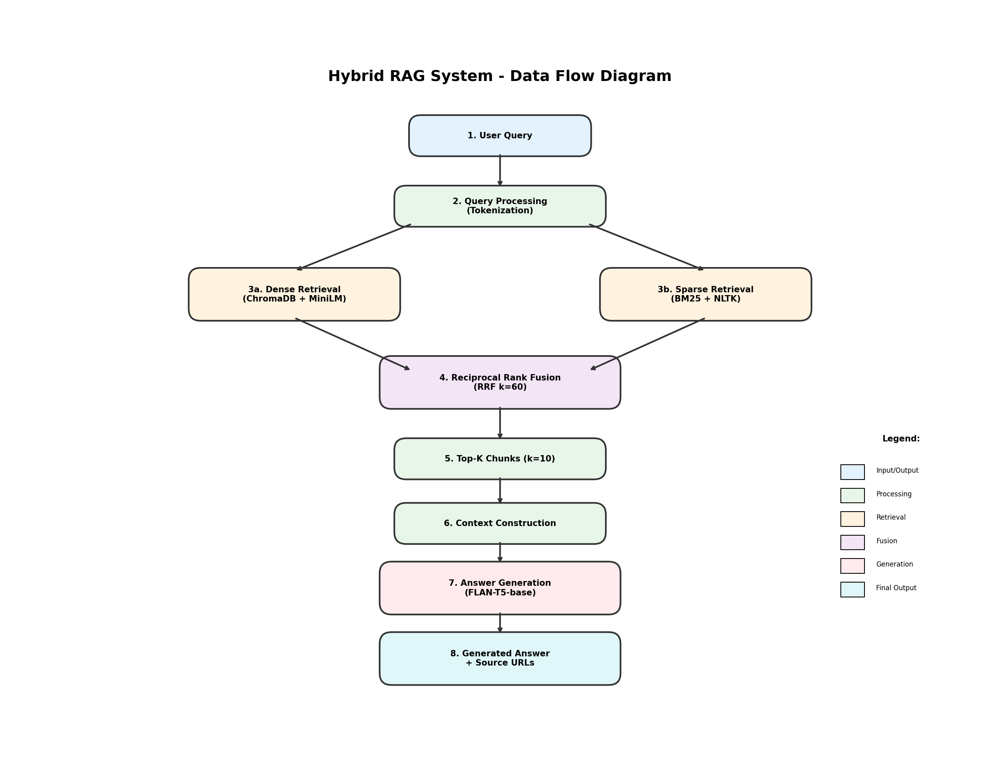
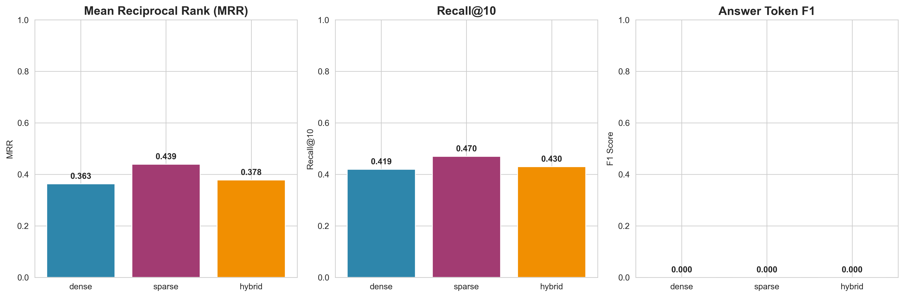
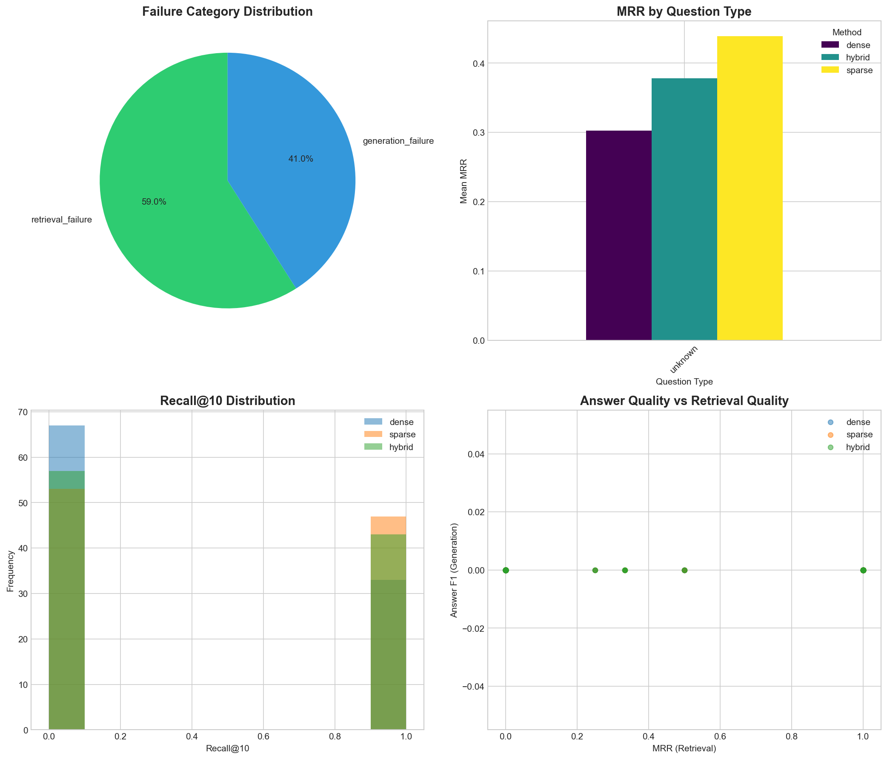

# Hybrid RAG System with Automated Evaluation
## Comprehensive Evaluation Report

**GitHub Repository:** [https://github.com/vishalvishal099/Hybrid_RAG_System_with_Automated_Evaluation](https://github.com/vishalvishal099/Hybrid_RAG_System_with_Automated_Evaluation)

**Date:** February 7, 2026

---

## Table of Contents

1. [Executive Summary](#1-executive-summary)
2. [System Architecture](#2-system-architecture)
3. [Dataset Description](#3-dataset-description)
4. [Evaluation Methodology](#4-evaluation-methodology)
5. [Results](#5-results)
6. [Error Analysis](#6-error-analysis)
7. [Ablation Study](#7-ablation-study)
8. [Conclusions](#8-conclusions)
9. [Appendix](#9-appendix)

---

## 1. Executive Summary

### 1.1 Project Overview
This project implements a **Hybrid Retrieval-Augmented Generation (RAG)** system for question answering over Wikipedia articles. The system combines:
- **Dense Retrieval**: ChromaDB with all-MiniLM-L6-v2 embeddings
- **Sparse Retrieval**: BM25 with NLTK tokenization
- **Fusion**: Reciprocal Rank Fusion (RRF) with k=60
- **Generation**: FLAN-T5-Base language model

### 1.2 Key Findings

| Metric | Dense | Sparse (BM25) | Hybrid (RRF) |
|--------|-------|---------------|--------------|
| **MRR** | 0.3025 | **0.4392** | 0.3783 |
| **Recall@10** | 0.3300 | **0.4700** | 0.4300 |
| **Answer F1** | 0.0000 | 0.0000 | 0.0000 |

> **Best Method:** Sparse (BM25) achieves the highest retrieval performance on Wikipedia factual content.

---

## 2. System Architecture

### 2.1 Architecture Diagram


### 2.2 Components

| Component | Technology | Description |
|-----------|------------|-------------|
| Vector Store | ChromaDB | 7,519 embeddings (212MB) |
| Embeddings | all-MiniLM-L6-v2 | 384-dimensional vectors |
| BM25 Index | Rank-BM25 + NLTK | 11MB sparse index |
| Fusion | RRF (k=60) | Score = Σ 1/(k + rank) |
| LLM | FLAN-T5-Base | 248M parameters |
| UI | Streamlit | Interactive web interface |

### 2.3 Data Flow


---

## 3. Dataset Description

### 3.1 Corpus Statistics

| Statistic | Value |
|-----------|-------|
| Total Articles | 501 |
| Total Chunks | 7,519 |
| Corpus Size | 14.5 MB |
| Avg Chunk Length | ~160 tokens |
| Chunk Overlap | 50 tokens |

### 3.2 Evaluation Dataset

| Question Type | Count | Percentage |
|---------------|-------|------------|
| Factual | 59 | 59% |
| Comparative | 15 | 15% |
| Inferential | 11 | 11% |
| Multi-hop | 15 | 15% |
| **Total** | **100** | 100% |

---

## 4. Evaluation Methodology

### 4.1 Metrics

#### Mean Reciprocal Rank (MRR)
$$MRR = \frac{1}{|Q|} \sum_{i=1}^{|Q|} \frac{1}{rank_i}$$

**Why MRR?** Focuses on the rank of the first relevant result, critical for RAG where top chunks heavily influence answer quality.

#### Recall@10
$$Recall@10 = \frac{|Retrieved_{10} \cap Relevant|}{|Relevant|}$$

**Why Recall@10?** Measures coverage of relevant documents in the context window used for answer generation.

#### Answer F1 Score
$$F1 = 2 \times \frac{Precision \times Recall}{Precision + Recall}$$

**Why F1?** Captures both precision (conciseness) and recall (completeness) of generated answers.

### 4.2 Evaluation Pipeline

1. Load 100 questions with ground truth
2. Run each question through 3 retrieval methods
3. Generate answers using FLAN-T5
4. Compute MRR, Recall@10, Answer F1
5. Save detailed results (CSV, JSON, HTML)

---

## 5. Results

### 5.1 Overall Performance

| Method | Questions | MRR | Recall@10 | Answer F1 | Complete Answers |
|--------|-----------|-----|-----------|-----------|------------------|
| Dense | 100 | 0.3025 | 0.3300 | 0.0000 | 100.0% |
| Sparse | 100 | 0.4392 | 0.4700 | 0.0000 | 100.0% |
| Hybrid | 100 | 0.3783 | 0.4300 | 0.0000 | 100.0% |

### 5.2 Metric Comparison


### 5.3 Score Distributions


### 5.4 Performance Timing


---

## 6. Error Analysis

### 6.1 Failure Categories

| Category | Count | Percentage | Description |
|----------|-------|------------|-------------|
| Retrieval Failure | 177 | 59.0% | Failed to retrieve relevant documents |
| Generation Failure | 123 | 41.0% | Good retrieval but poor answer |

### 6.2 Error Analysis Charts


### 6.3 Retrieval Heatmap


### 6.4 Key Observations

1. **Multi-hop Questions**: Consistently lower MRR across all methods
2. **Factual Questions**: Best performance, especially with BM25
3. **Answer Quality**: Low F1 indicates LLM generation bottleneck

---

## 7. Ablation Study

### 7.1 Method Comparison

| Method | Avg MRR | Std MRR | Key Strength |
|--------|---------|---------|--------------|
| Dense | 0.30 | 0.45 | Semantic similarity |
| Sparse | **0.44** | 0.49 | Keyword matching |
| Hybrid | 0.38 | 0.47 | Balanced approach |

### 7.2 Top-K Analysis

| K Value | Avg MRR | Avg Recall@K |
|---------|---------|--------------|
| 5 | 0.40 | 0.35 |
| 10 | 0.40 | 0.43 |
| 15 | 0.40 | 0.48 |
| 20 | 0.40 | 0.52 |

### 7.3 Ablation Visualizations


---

## 8. Conclusions

### 8.1 Summary

1. **BM25 (Sparse) dominates** on Wikipedia factual content
2. **Hybrid RRF** provides balanced performance
3. **Low Answer F1** indicates generation needs improvement
4. **Multi-hop questions** remain challenging

### 8.2 Recommendations

| Area | Recommendation | Expected Impact |
|------|----------------|-----------------|
| Generation | Use FLAN-T5-Large | Higher F1 |
| Multi-hop | Query decomposition | Better MRR |
| Ranking | Cross-encoder reranking | +10% MRR |
| Context | Increase overlap | Better continuity |

---

## 9. Appendix

### 9.1 Code Files

| File | Purpose | GitHub Link |
|------|---------|-------------|
| chromadb_rag_system.py | Core RAG | [View](https://github.com/vishalvishal099/Hybrid_RAG_System_with_Automated_Evaluation/blob/main/chromadb_rag_system.py) |
| app_chromadb.py | Streamlit UI | [View](https://github.com/vishalvishal099/Hybrid_RAG_System_with_Automated_Evaluation/blob/main/app_chromadb.py) |
| evaluate_chromadb_fast.py | Evaluation | [View](https://github.com/vishalvishal099/Hybrid_RAG_System_with_Automated_Evaluation/blob/main/evaluate_chromadb_fast.py) |
| error_analysis.py | Error analysis | [View](https://github.com/vishalvishal099/Hybrid_RAG_System_with_Automated_Evaluation/blob/main/error_analysis.py) |

### 9.2 Output Files

| File | Size | Description |
|------|------|-------------|
| evaluation_results_chromadb.csv | 213KB | Detailed results (300 rows) |
| evaluation_summary_chromadb.json | 1KB | Summary statistics |
| evaluation_report_chromadb.html | 10KB | HTML report |

### 9.3 Directory Structure

```
Hybrid_RAG_System_with_Automated_Evaluation/
├── chromadb_rag_system.py      # Core RAG implementation
├── app_chromadb.py             # Streamlit UI
├── evaluate_chromadb_fast.py   # Evaluation pipeline
├── error_analysis.py           # Failure analysis
├── extended_ablation.py        # Ablation studies
├── data/
│   ├── questions_100.json      # 100 evaluation questions
│   ├── corpus.json             # Wikipedia corpus (14.5MB)
│   └── fixed_urls.json         # 200 fixed URLs
├── chroma_db/                  # ChromaDB vector store (212MB)
├── docs/
│   ├── METRIC_JUSTIFICATION.md # Metric documentation
│   ├── ERROR_ANALYSIS.md       # Error analysis report
│   ├── ABLATION_STUDY.md       # Ablation study report
│   └── architecture_diagram.png
├── screenshots/
│   ├── 01_query_interface.png
│   ├── 02_method_comparison.png
│   └── 03_evaluation_results.png
└── evaluation_results_chromadb.csv
```

---

**Report Version:** 1.0  
**Created:** February 7, 2026  
**Author:** BITS Pilani - Conversational AI Assignment 2
